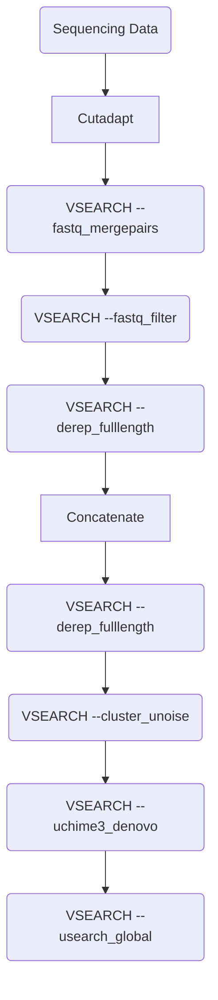

# Metabarcoding - Pipeline

This is a Metabarcoding Pipeline developed for Illumina Sequencing Data at the
Thuenen Institute of Biodiversity, Braunschweig by Wiebke Sickel & Lasse
Krueger.

## Prerequisites

The Pipeline is managed by [Snakemake](https://snakemake.readthedocs.io/) and
uses various tools, which are specified in Conda environment files in the
`envs/` directory. All that is needed to start the pipeline is a current version
of [Conda](https://docs.conda.io/). When the pipeline is run for the first
time, the required software is automatically installed in Conda environments.
[Mamba](https://mamba.readthedocs.io/) can be used as an alternative to Conda.

Additionally required are:
- files containing paired end reads of Illumina sequencing data for the used
  metabarcoding marker; file names should follow the pattern
  `{prefix}_R(1|2)_{suffix}.(fastq|fq).gz` where each combination of `prefix`
  and `suffix` represent a single sample.
- config file in YAML format with all required information; modify the template
  `example_config.yaml` as described below.


## Execution and performance parameters

The input/output paths and pipeline options are declared in a configuration
file. The sample config file `example_config.yaml` is set up to run the test
dataset in the `test/` subfolder.

Use the bash script `run_pipeline.sh` to execute the pipeline.

```bash
bash run_pipeline.sh example_config.yaml
```

Snakemake itself will be installed to a Conda environment named `mb_snakemake`,
which will be activated before running the pipeline, if this environment does
not already exist.


Performance-related options are specified in the `run_pipeline.sh` script; see
the [Snakemake
documentation](https://snakemake.readthedocs.io/en/stable/executing/cli.html)
for the complete list:

* `--threads 8` - Change total number of threads available for the pipeline
* `--dryrun` - Show rules that will be run only, do not actually execute
* `--notemp` - Keep temporary files (trimmed, merged, dereplicated reads);
               remove this flag to discard them after run.
* `--conda-frontend conda` - Specify `conda` or `mamba` to manage environments


## Config File Structure

The config file is a simple .yaml file containing all required information. An
example config file is provided: `example_config.yaml`.

#### Working directory path

Specify the path to write all results and logs:

```yaml
workdir: test
```

Other paths in the config file are relative to the `workdir`; alternatively,
absolute paths can be specified.


Specify the directory containing the sequencing reads at `input` key.

```yaml
input: /home/user/metabarcoding_raw_data
```

### Paired- or single-end reads
If paired end reads are used, specify this at the `paired` key. This key
accepts only `true` or `false`.

```yaml
paired: true
```

### Adapter Trimming

The tool used for adapter trimming in this pipeline is cutadapt. The config
file is structured in such a way that all parameters for cutadapt can also be
specified via the config file. The most important information to be specified
here are the adapter sequences. Another useful parameter can be the minimum
overlap (`-O`). If other parameters are required, please consult the <a
href="https://cutadapt.readthedocs.io/en/stable/index.html" title =
"cutadapt_link"> cutadapt documentation</a>.

```yaml
adapter_trimming_options:
  - "-g ATGCGATACTTGGTGTGAAT"
  - "-G GACGCTTCTCCAGACTACAAT"
  - "-O 23"
```

### Merging paired reads

To merge the forward and reverse reads, the `--fastq_mergepairs` argument of
the VSEARCH tool is used. All possible parameters can be found on the
corresponding documentation on the <a
href="https://github.com/torognes/vsearch" title = "vsearch_link">GitHub
page</a>.

```yaml
merge_options:
  - "--fastq_allowmergestagger"
  - "--fastq_minovlen 100"
  - "--fastq_maxdiffs 15"
  - "--fastq_eeout"
```

### Quality Filtering

```yaml
filter_options:
  - "--fastq_maxee 1.0"
  - "--fastq_minlen 200"
  - "--fastq_maxlen 500"
  - "--fastq_maxns 0"
  - "--fasta_width 0"
```

### Dereplication

First round:

```yaml
derep1_options:
  - "--strand plus"
  - "--sizeout"
  - "--fasta_width 0"
```

Second round:

### Protein coding sequences

Protein-coding sequences (e.g. the mitochondrial cytochrome oxidase I marker
sequence) can be processed differently from non-coding sequences (e.g. tRNA or
rRNA markers). Instead of filtering for chimeras with UCHIME, putative
pseudogenes are removed that have excessive in-frame stop codons or where the
translation does not match a HMM of the target protein.

Activate the coding sequence-specific subworkflow with:

```yaml
protein_coding: true
```

Genetic code and a HMM file of the target protein should be supplied to screen
translated sequences for pseudogenes; PCR chimeras should also be filtered out
in this step. The approach is adapted from [Porter & Hajibabaei,
2021](https://doi.org/10.1186/s12859-021-04180-x).

```yaml
coding:
  frame: 3 # default for the Leray fragment of mtCOI
  code: 5 # Genetic code, must not be a stopless code
  hmm: null # path to the HMM file, relative to workdir
```

Entropy ratio-based distance denoising with DnoisE (see below) is only
available for coding sequences; the reading frame must be specified. However it
is possible to denoise with DnoisE but still use UCHIME to remove chimeras.

### Denoising

Denoising is performed with Unoise ([Edgar,
2016](https://doi.org/10.1101/081257 )) implemented in
[Vsearch](https://github.com/torognes/vsearch) by default, but DnoisE (see
below) is an option for coding sequences.

Specify either `unoise` or `dnoise` to the key `method` under `denoising`.

```yaml
denoising:
  method: 'unoise'
  alpha: 5
  minsize: 8
```

Both methods use the parameters alpha and minsize.

Parameter alpha controls the tradeoff between "sensitivity to small differences
against an increase in the number of bad sequences which are wrongly predicted
to be good." Higher values of alpha retain more sequences (more sensitive, more
bad sequences), whereas lower values retain fewer (less sensitive, fewer bad
sequences).

Minsize is the minimum number of sequences represented by a cluster after
denoising.

#### Denoising with DnoisE

This will perform entropy-based distance denoising with
[DnoisE](https://github.com/adriantich/DnoisE/) ([Antich et al.,
2022](https://doi.org/10.7717/peerj.12758)) instead of Vsearch Unoise.

The expected reading frame of the amplified metabarcoding fragment should be
known, based on the PCR primers used, and denote the codon position (1, 2, or
3) of the first base in the fragment.

DnoisE can calculate the entropy ratio of codon positions 2 and 3 to help set
values of the denoising parameter alpha and the minimum cluster size. Specify
the range of alpha and minsize values to test:

```yaml
alpha_range: [1,2,3,4,5,6,7,8,9,10]
minsize_range: [2,3,4,5,6,7,8,9,10,20,30,40,50,60,70,80,90,100]
```

The pipeline first runs with the default alpha and minsize values (see below),
and also produces plots of entropy ratio vs. alpha and minsize for the
specified ranges. After reviewing the plots, the user can update the default
values if necessary.


### Chimera check

Chimera check with UCHIME implemented in Vsearch.

```yaml
chimera_check_options:
  - "--sizein"
  - "--sizeout"
  - "--fasta_width 0"
```

### Community Table Creation

```yaml
community_table_options:
  - "--id 0.97"
  - "--strand plus"
  - "--threads 6"
  - "--sizein"
  - "--sizeout"
```

### Reference databases for taxonomic classification

These can be either in Fasta or UDB format (faster, as it avoids re-indexing
every time the pipeline is run).

```yaml
direct_dbs:
  - "/mnt/data/databases/bcd_ITS2/its2_viridiplantae_de.fa"
  - "/mnt/data/databases/bcd_ITS2/its2_viridiplantae_eu.fa"
hierarchical_db: "/mnt/data/databases/bcd_ITS2/its2_viridiplantae_all.fa"
```

### Classification Thresholds

```yaml
classification_threshold: "0.97"
hierarchical_threshold: "0.8"
```

## Unlocking
Snakemake by default locks the directories in which the results are saved. If a
run fails, the directories remain locked and if you attempt to rerun the
pipeline with the same output directory, you get an error message. To unlock
the directory, simply run the following script:

```bash
bash run_pipeline.sh example_config.yaml
```

## Workflow


