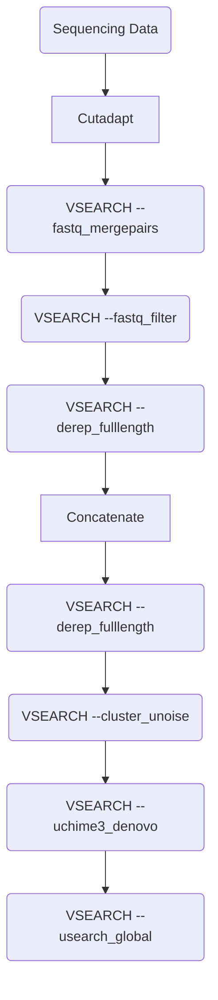

# Metabarcoding - Pipeline

This is a Metabarcoding Pipeline developed for Illumina Sequencing Data at the
Thuenen Institute of Biodiversity, Braunschweig by Wiebke Sickel & Lasse
Krueger.

## 1. Prerequisites

The Pipeline is managed by [Snakemake](https://snakemake.readthedocs.io/) and
uses various tools, which are specified in Conda environment files in the
`envs/` directory. All that is needed to start the pipeline is a current version
of [Conda](https://docs.conda.io/). When the pipeline is run for the first
time, the required software is automatically installed in Conda environments.
[Mamba](https://mamba.readthedocs.io/) can be used as an alternative to Conda.

Additionally required are:
- files containing paired end reads of Illumina sequencing data for the used
  metabarcoding marker; file names should follow the pattern
  `{prefix}_R(1|2)_{suffix}.(fastq|fq).gz` where each combination of `prefix`
  and `suffix` represent a single sample.
- config file in YAML format with all required information; modify the template
  `example_config.yaml` as described below.

### 1.1 Execution

The command to start the pipeline is really simple, because all required
information is declared in the config file.

```bash
bash run_pipeline.sh example_config.yaml
```

Snakemake itself will be installed to a Conda environment named `mb_snakemake`,
which will be activated before running the pipeline, if this environment does
not already exist.

### 1.1 Config File Structure

The config file is a simple .yaml file containing all required information. An
example config file is provided: `example_config.yaml`.

#### 1.1.1 Input

You can specify the path to the directory containing the paired end reads at
the `directory` key.

```yaml
directory: /home/user/metabarcoding_raw_data
```
#### 1.1.2 Output

The directory in which all the results will be stored can be specified at the
`output` key.

```yaml
output: /home/user/metabarcoding_results
```

#### 1.1.3 Paired
If paired end reads are used, be sure to specify this at the `paired` key. This
key accepts only `true` or `false`.

```yaml
paired: true
```


#### 1.1.4 Adapter Trimming

The tool used for adapter trimming in this pipeline is cutadapt. The config
file is structured in such a way that all parameters for cutadapt can also be
specified via the config file. The most important information to be specified
here are the adapter sequences. Another useful parameter can be the minimum
overlap (`-O`). If other parameters are required, please consult the <a
href="https://cutadapt.readthedocs.io/en/stable/index.html" title =
"cutadapt_link"> cutadapt documentation</a>.

```yaml
adapter_trimming_options:
  - "-g ATGCGATACTTGGTGTGAAT"
  - "-G GACGCTTCTCCAGACTACAAT"
  - "-O 23"
```

#### 1.1.5 Merging

To merge the forward and reverse reads, the `--fastq_mergepairs` argument of
the VSEARCH tool is used. All possible parameters can be found on the
corresponding documentation on the <a
href="https://github.com/torognes/vsearch" title = "vsearch_link">GitHub
page</a>.

This part is only necessary for paired end reads.

```yaml
merge_options:
  - "--fastq_allowmergestagger"
  - "--fastq_minovlen 100"
  - "--fastq_maxdiffs 15"
  - "--fastq_eeout"
```

#### 1.1.6 Quality Filtering

```yaml
filter_options:
  - "--fastq_maxee 1.0"
  - "--fastq_minlen 200"
  - "--fastq_maxlen 500"
  - "--fastq_maxns 0"
  - "--fasta_width 0"
```

#### 1.1.7 First Dereplication

```yaml
derep1_options:
  - "--strand plus"
  - "--sizeout"
  - "--fasta_width 0"
```

#### 1.1.8 Second Dereplication

```yaml
derep2_options:
  - "--sizein"
  - "--sizeout"
  - "--fasta_width 0"
```

#### 1.1.9 Denoising

```yaml
denoise_options:
  - "--sizein"
  - "--sizeout"
  - "--fasta_width 0"
```

#### 1.1.10 Chimera Check

```yaml
chimera_check_options:
  - "--sizein"
  - "--sizeout"
  - "--fasta_width 0"
```

#### 1.1.11 Community Table Creation

```yaml
community_table_options:
  - "--id 0.97"
  - "--strand plus"
  - "--threads 6"
  - "--sizein"
  - "--sizeout"
```

#### 1.1.12 Databases

```yaml
direct_dbs:
  - "/mnt/data/databases/bcd_ITS2/its2_viridiplantae_de.fa"
  - "/mnt/data/databases/bcd_ITS2/its2_viridiplantae_eu.fa"
hierarchical_db: "/mnt/data/databases/bcd_ITS2/its2_viridiplantae_all.fa"
```

#### 1.1.13 Classification Thresholds

```yaml
classification_threshold: "0.97"
hierarchical_threshold: "0.8"
```

#### 1.1.14 Threads

```yaml
threads: 6
```

### 1.2 Unlocking
Snakemake by default locks the directories in which the results are saved. If a
run fails, the directories remain locked and if you attempt to rerun the
pipeline with the same output directory, you get an error message. To unlock
the directory, simply run the following script:

```bash
bash run_pipeline.sh example_config.yaml
```

## 2. Workflow


