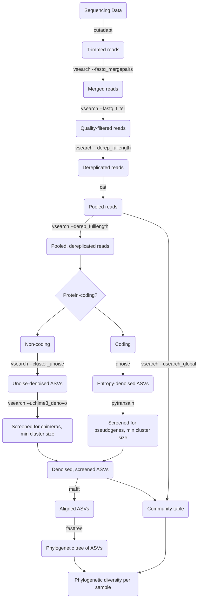

# Metabarcoding - Pipeline

This is a Metabarcoding Pipeline developed for Illumina Sequencing Data at the
Thuenen Institute of Biodiversity, Braunschweig by Wiebke Sickel & Lasse
Krueger, with contributions from Brandon Seah.


## Prerequisites

The Pipeline is managed by [Snakemake](https://snakemake.readthedocs.io/) and
uses various tools, which are specified in Conda environment files in the
`workflow/envs` directory. All that is needed to start the pipeline is a
current version of [Conda](https://docs.conda.io/). When the pipeline is run
for the first time, the required software is automatically installed in Conda
environments. [Mamba](https://mamba.readthedocs.io/) can be used as an
alternative to Conda.

Input data should be short-read metabarcoding sequence data (paired- or
single-end) in Fastq or gzipped Fastq format. File paths and pipeline
options/parameters are specified in config files (see below).

A reference database in Fasta format is required for taxonomic classification.
The Fasta headers should contain the taxonomy string in SINTAX format, as
described in the [Vsearch
manual](https://github.com/torognes/vsearch/releases/download/v2.26.1/vsearch_manual.pdf).


## Setting up the pipeline

Depending on your familiarity with Snakemake, there are several ways to use set
up this pipeline to use with your own data.


### Option 1. Download or clone from GitHub

Clone the pipeline directly from GitHub:

```bash
git clone git@github.com:monagrland/MB_Pipeline.git
```

To clone a specific version, specify its tag with the `--branch` option.

Alternatively, download a zipped archive of the source code from the [GitHub
releases page](https://github.com/monagrland/MB_Pipeline/releases).


### Option 2. Deploy with Snakedeploy

[Snakedeploy](https://snakedeploy.readthedocs.io/en/latest/) is a tool to
deploy Snakemake pipelines that have been published on platforms like GitHub or
GitLab.

You can deploy either a specific version with the `--tag` option, or a specific
branch with `--branch`:

```bash
snakedeploy deploy-workflow https://github.com/kbseah/MB_Pipeline ./my_deployment --branch master
cd my_deployment
```

The template configuration will be copied to the `config/` subfolder, and
should be modified with your desired configuration.

This usage pattern is relevant when you wish to apply the same pipeline to
different sets of input data, each requiring their own configuration. In this
way, each separate deployment can be run and put under version control,
indepedently of each other and the the pipeline itself.

To rerun under a new pipeline version, simply change the version specified in
the module directive in the Snakefile.


### Option 3. Deploy as a module in another workflow

This is similar to option 2 above, except that you wish to incorporate
MB_Workflow in an existing Snakemake pipeline. Instead of using the Snakedeploy
command line tool to set up a new template workflow, you should directly add a
`module` declaration to the existing workflow. See the [Snakemake
documentation](https://snakemake.readthedocs.io/en/stable/snakefiles/deployment.html#using-and-combining-pre-exising-workflows)


## Configuration

The pipeline options and input/output paths are declared in a configuration
file `config/config.yaml` and table `config/reads.tsv` respectively. These
should be modified to match the actual data and analysis you want to perform.

The sample files provided are configured to run the test dataset in the
`testdata/` subfolder without further modification, and can be used to test the
pipeline.

Configuration options are described in the `config/README.md` file.


## Execution and performance parameters

The pipeline is executed with `snakemake`, specifying the path to the config
file with the `--configfile` parameter, and other options. `mamba` or `conda`
should also be in your path. The python package `pandas` should be available in
the environment.

Output will be written to the subfolder `results/`, and log files to `logs/`,
which will be created if they do not already exist.

Examine and/or modfiy the bash script `run_pipeline.sh` for typical defaults.
The script first installs Snakemake and other dependencies required to run the
pipeline in a Conda environment at `./snakemake_8`, which will be activated
before running the pipeline, if this environment does not already exist at this
path.

```bash
bash run_pipeline.sh # uses config file at config/config.yaml by default
```

Performance-related options include:

* `--cores` - Change total number of CPU cores available for the pipeline
* `--dryrun` - Show rules that will be run only, do not actually execute
* `--notemp` - Keep temporary files (trimmed, merged, dereplicated reads);
               remove this flag to discard them after run.
* `--conda-frontend conda` - Specify `conda` or `mamba` (recommended) to manage
                             environments

See the [Snakemake
documentation](https://snakemake.readthedocs.io/en/stable/executing/cli.html)
for the complete list:


## Unlocking

Snakemake by default locks the directories in which the results are saved. If a
run fails, the directories remain locked and if you attempt to rerun the
pipeline with the same output directory, you get an error message. To unlock
the directory, simply run the following script:

```bash
bash unlock.sh config/config.yaml
```


## Workflow description

Raw sequencing reads are first trimmed of adapter sequences with
[Cutadapt](https://cutadapt.readthedocs.io/en/stable/).  Paired-end reads are
merged into the complete amplicon sequence with
[VSEARCH](https://github.com/torognes/vsearch).  For each sample, reads are
then filtered for quality, and exactly identical sequences are deduplicated,
both steps with VSEARCH. Reads are then pooled across all samples and
deduplicated again to obtain the pooled, dereplicated amplicon sequences.

If the barcoding marker sequence is not from a protein-coding gene, they are
first clustered with the UNOISE algorithm as implemented in VSEARCH. The
resulting amplicon sequence variants (ASVs) are then screened for PCR chimeras
with the [UCHIME3 denovo
algorithm](https://www.drive5.com/usearch/manual/cmd_uchime3_denovo.html) as
implemented in VSEARCH, to produce the set fo denoised, artefact-filtered ASVs.

If the sequence is protein-coding, the sequences are instead denoised with the
entropy ratio-based denoising method
[DnoisE](https://github.com/adriantich/DnoisE). They are then translated in all
forward reading frames with
[pytransaln](https://github.com/monagrland/pytransaln) and screened against a
HMM of the target protein sequence (using
[pyhmmer](https://github.com/althonos/pyhmmer) and [HMMer](https://hmmer.org/)
internally), to screen out pseudogenes and to find the correct reading frame.
PCR chimeras should also be indirectly removed at this step.

The per-sample abundance of sequences represented by each final ASV is
calculated by re-aligning them with VSEARCH with the global alignment option.

Denoised, screened ASVs are aligned with
[MAFFT](https://mafft.cbrc.jp/alignment/software/), and used to build a
phylogenetic tree, from which the phylogenetic diversity per sample is
calculated.

A consensus taxonomy per representative ASV is also reported based on the
user-supplied reference database, using either the SINTAX algorithm as
implemented in VSEARCH, or an experimental two-step heuristic method.

For full parameter details please see the `config/README.md` file.



